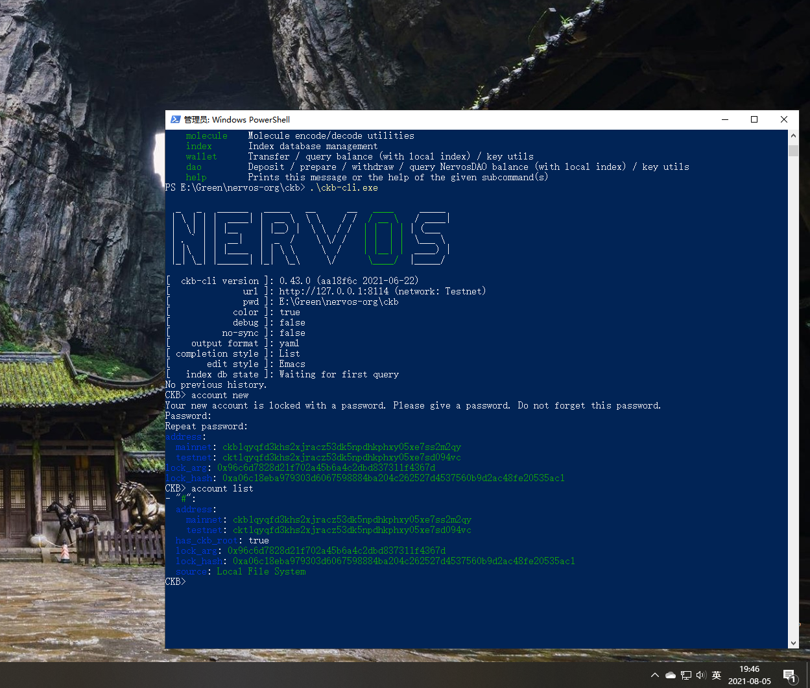
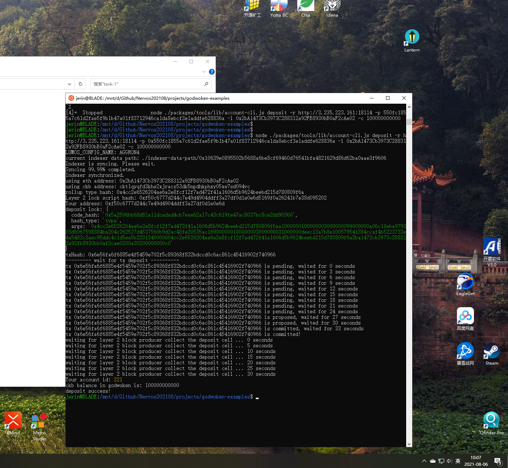

Task 1
===
1. A screenshot of the accounts you created (account list) in ckb-cli.

2. A link to the Layer 1 address you funded on the Testnet Explorer: 
[ckt1qyqfd3khs2xjracz53dk5npdhkphxy05xe7sd094vc](https://explorer.nervos.org/aggron/address/ckt1qyqfd3khs2xjracz53dk5npdhkphxy05xe7sd094vc)

3. A screenshot of the console output immediately after you have successfully submitted a deposit to Layer 2.

---

Steps
===
address:
  mainnet: ckb1qyqfd3khs2xjracz53dk5npdhkphxy05xe7ss2m2qy
  testnet: ckt1qyqfd3khs2xjracz53dk5npdhkphxy05xe7sd094vc
lock_arg: 0x96c6d7828d21f702a45b6a4c2dbd837311f4367d
lock_hash: 0xa06c18eba979303d6067598884ba204c262527d4537560b9d2ac48fe20535ac1

0. Export Your Private Key
cmd: ckb-cli: account export --lock-arg 0x96c6d7828d21f702a45b6a4c2dbd837311f4367d --extended-privkey-path C:\privkey.txt
result:
550fc1855a7c61d2fae5f9b1b47a01f83712946ca1da8ebcf3e1addfe628836a
08de1c9f62290bdc5e162be50a56d8161cfbe43a630c73ee555bdbd71ccc3c6e

> The first line of this file is your private key. To use it with applications we need to copy it from this file, and add the '0x' prefix to mark it as hex string.
> 
> The second line in the file is chain code for the BIP44 standard, but we will not use this so it can be safely ignored.

1. Convert An Ethereum Address to a Polyjuice Address
cmd: node ./packages/tools/lib/account-cli.js to-short-address -a 0x2bA1473Cb3973C288312a92FB8930bB0aF2cAe02
result: godwoken short address: 0xf50c6777d244c7e49d4904ddff3a27df0d1e0e6d

2. Convert a Polyjuice Address to an Ethereum Address
cmd: node ./packages/tools/lib/account-cli.js to-eth-address -a 0xf50c6777d244c7e49d4904ddff3a27df0d1e0e6d

3. Make a Deposit to Layer 2
cmd: node ./packages/tools/lib/account-cli.js deposit -r http://3.235.223.161:18114 -p 0x550fc1855a7c61d2fae5f9b1b47a01f83712946ca1da8ebcf3e1addfe628836a -l 0x2bA1473Cb3973C288312a92FB8930bB0aF2cAe02 -c 100000000000

