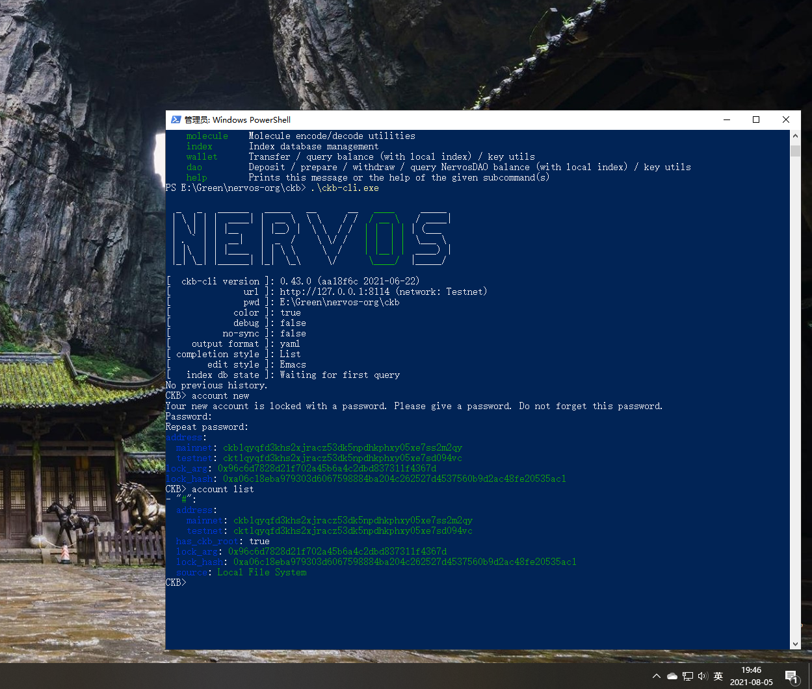
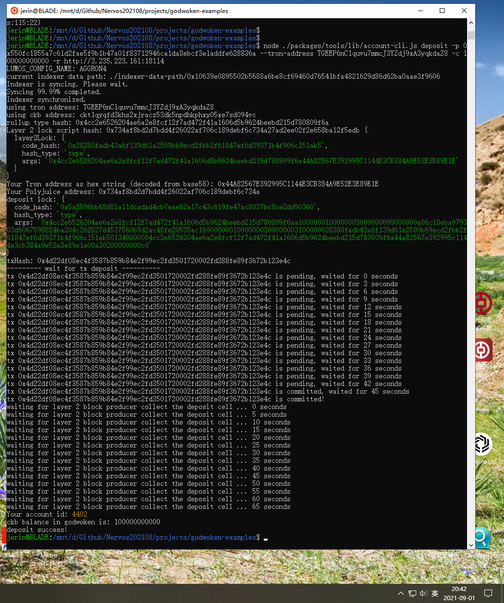
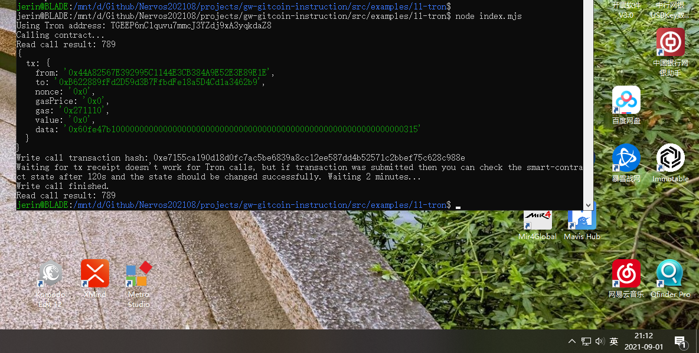

Task 11: Use a Tron Wallet to Execute a Smart Contract Call
===

1. A screenshot of the accounts you created (account list) in ckb-cli.


2. A link to the Layer 1 address you funded on the Testnet Explorer.
[ckt1qyqfd3khs2xjracz53dk5npdhkphxy05xe7sd094vc](https://explorer.nervos.org/aggron/address/ckt1qyqfd3khs2xjracz53dk5npdhkphxy05xe7sd094vc)

3. A screenshot of the console output immediately after you have successfully submitted a CKByte deposit to your Tron account on Layer 2.


4. A screenshot of the console output immediately after you have successfully issued a smart contract calls on Layer 2.


5. The transaction hash of the "Contract call" from the console output (in text format).

Write call transaction hash: 0xe7155ca190d18d0fc7ac5be6839a8cc12ee587dd4b52571c2bbef75c628c988e
```
jerin@BLADE:/mnt/d/Github/Nervos202108/projects/gw-gitcoin-instruction/src/examples/11-tron$ node index.mjs
Using Tron address: TGEEP6nC1quvu7mmcJ3YZdj9xA3yqkdaZ8
Calling contract...
Read call result: 789
{
  tx: {
    from: '0x44A82567E392995C1144E3CB384A9E52E3E89E1E',
    to: '0xB622889fFd2D59d3B7FfbdFe18a5D4Cd1a3462b9',
    nonce: '0x0',
    gasPrice: '0x0',
    gas: '0x271110',
    value: '0x0',
    data: '0x60fe47b10000000000000000000000000000000000000000000000000000000000000315'
  }
}
Write call transaction hash: 0xe7155ca190d18d0fc7ac5be6839a8cc12ee587dd4b52571c2bbef75c628c988e
Waiting for tx receipt doesn't work for Tron calls, but if transaction was submitted then you can check the smart-contract state after 120s and the state should be changed successfully. Waiting 2 minutes...
Write call finished.
Read call result: 789
```

6. The contract address that you called (in text format).

0xB622889fFd2D59d3B7FfbdFe18a5D4Cd1a3462b9

7. The ABI for contract you made a call on (in text format).
```
[
    {
      "inputs": [],
      "stateMutability": "payable",
      "type": "constructor"
    },
    {
      "inputs": [
        {
          "internalType": "uint256",
          "name": "x",
          "type": "uint256"
        }
      ],
      "name": "set",
      "outputs": [],
      "stateMutability": "payable",
      "type": "function"
    },
    {
      "inputs": [],
      "name": "get",
      "outputs": [
        {
          "internalType": "uint256",
          "name": "",
          "type": "uint256"
        }
      ],
      "stateMutability": "view",
      "type": "function"
    }
  ]
```

8. Your Tron address (in text format).
TGEEP6nC1quvu7mmcJ3YZdj9xA3yqkdaZ8


---

Steps
===

## 0 CKB
* address:
  * mainnet: ckb1qyqfd3khs2xjracz53dk5npdhkphxy05xe7ss2m2qy
  * testnet: ckt1qyqfd3khs2xjracz53dk5npdhkphxy05xe7sd094vc
* lock_arg: 0x96c6d7828d21f702a45b6a4c2dbd837311f4367d
* lock_hash: 0xa06c18eba979303d6067598884ba204c262527d4537560b9d2ac48fe20535ac1

Export Your Private Key:
* 550fc1855a7c61d2fae5f9b1b47a01f83712946ca1da8ebcf3e1addfe628836a
* 08de1c9f62290bdc5e162be50a56d8161cfbe43a630c73ee555bdbd71ccc3c6e

> The first line of this file is your private key. To use it with applications we need to copy it from this file, and add the '0x' prefix to mark it as hex string.
> The second line in the file is chain code for the BIP44 standard, but we will not use this so it can be safely ignored.

## 1 [Create a Godwoken Account by Making a Layer 2 Deposit Using a Tron Wallet](https://github.com/Kuzirashi/gw-gitcoin-instruction/blob/master/src/component-tutorials/9.layer2.deposit.tron.md)
command:
node ./packages/tools/lib/account-cli.js deposit -p 0x550fc1855a7c61d2fae5f9b1b47a01f83712946ca1da8ebcf3e1addfe628836a --tron-address TGEEP6nC1quvu7mmcJ3YZdj9xA3yqkdaZ8 -c 100000000000 -r http://3.235.223.161:18114

output:
```
LUMOS_CONFIG_NAME: AGGRON4
current indexer data path: ./indexer-data-path/0x10639e0895502b5688a6be8cf69460d76541bfa4821629d86d62ba0aae3f9606
Indexer is syncing. Please wait.
Syncing 99.99% completed.
Indexer synchronized.
using tron address: TGEEP6nC1quvu7mmcJ3YZdj9xA3yqkdaZ8
using ckb address: ckt1qyqfd3khs2xjracz53dk5npdhkphxy05xe7sd094vc
rollup type hash: 0x4cc2e6526204ae6a2e8fcf12f7ad472f41a1606d5b9624beebd215d780809f6a
Layer 2 lock script hash: 0x734af8bd2d7bdd4f26022af706c189debf6c734a27ad2ee02f2e658ba12f5edb {
  layer2Lock: {
    code_hash: '0x28380fadb43a6f139d61a2509b69ecd2fbb2f61847ef6d39371b4f906c151ab5',
    hash_type: 'type',
    args: '0x4cc2e6526204ae6a2e8fcf12f7ad472f41a1606d5b9624beebd215d780809f6a44A82567E392995C1144E3CB384A9E52E3E89E1E'
  }
}
Your Tron address as hex string (decoded from base58): 0x44A82567E392995C1144E3CB384A9E52E3E89E1E
Your Polyjuice address: 0x734af8bd2d7bdd4f26022af706c189debf6c734a
deposit lock: {
  code_hash: '0x5a2506bb68d81a11dcadad4cb7eae62a17c43c619fe47ac8037bc8ce2dd90360',
  hash_type: 'type',
  args: '0x4cc2e6526204ae6a2e8fcf12f7ad472f41a1606d5b9624beebd215d780809f6aa1000000100000003000000099000000a06c18eba979303d6067598884ba204c262527d4537560b9d2ac48fe20535ac16900000010000000300000003100000028380fadb43a6f139d61a2509b69ecd2fbb2f61847ef6d39371b4f906c151ab501340000004cc2e6526204ae6a2e8fcf12f7ad472f41a1606d5b9624beebd215d780809f6a44a82567e392995c1144e3cb384a9e52e3e89e1e00a30200000000c0'
}
txHash: 0x4d22df08ec4f3587b859b84e2f99ec2fd3501720002fd288fe89f3672b123e4c
--------- wait for tx deposit ----------
tx 0x4d22df08ec4f3587b859b84e2f99ec2fd3501720002fd288fe89f3672b123e4c is pending, waited for 0 seconds
...
tx 0x4d22df08ec4f3587b859b84e2f99ec2fd3501720002fd288fe89f3672b123e4c is committed, waited for 45 seconds
tx 0x4d22df08ec4f3587b859b84e2f99ec2fd3501720002fd288fe89f3672b123e4c is committed!
waiting for layer 2 block producer collect the deposit cell ... 0 seconds
...
waiting for layer 2 block producer collect the deposit cell ... 65 seconds
Your account id: 4402
ckb balance in godwoken is: 100000000000
deposit success!
```

## 2 Contract deployed in task 2
Deployed contract address: 0xB622889fFd2D59d3B7FfbdFe18a5D4Cd1a3462b9

## 3 Prepare and Run the Example Code to Call the Smart Contract


**the output result**
```

```