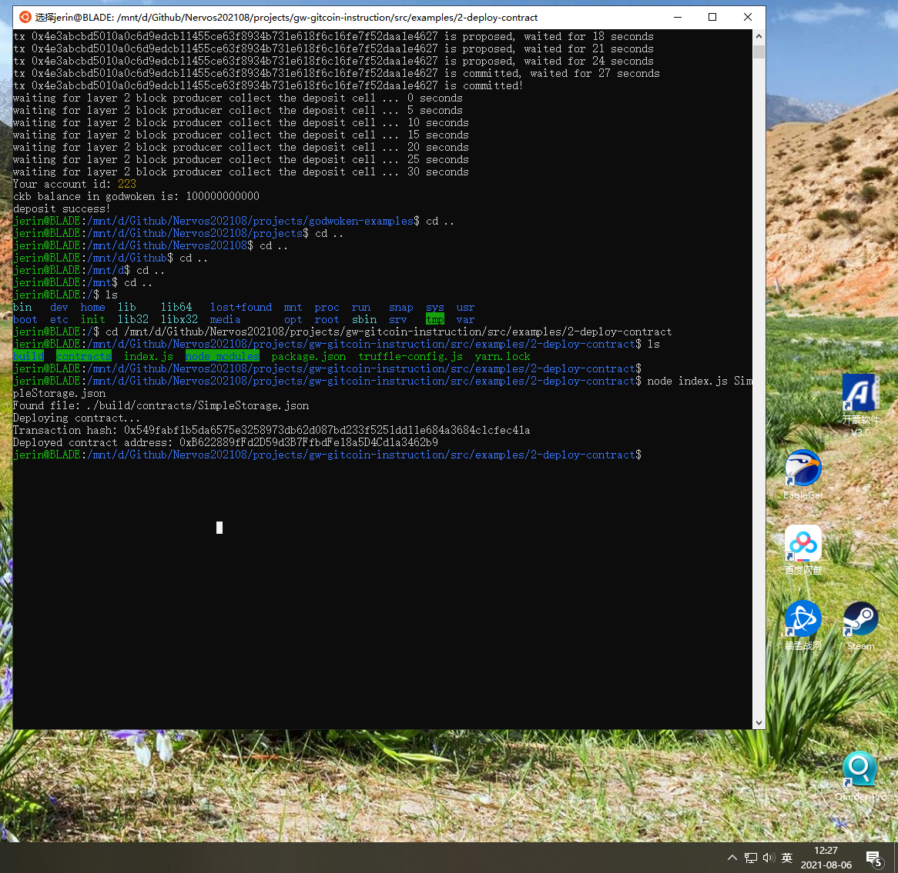

Task 2
===
1. A screenshot of the console output immediately after you have successfully deployed a smart contract.

2. The transaction hash from the contract deployment (in text format).
Transaction hash: 0x549fabf1b5da6575e3258973db62d087bd233f5251dd11e684a3684c1cfec41a

3. The deployed contract address from the contract deployment (in text format).
Deployed contract address: 0xB622889fFd2D59d3B7FfbdFe18a5D4Cd1a3462b9

---

Steps
===

address:
  mainnet: ckb1qyqfd3khs2xjracz53dk5npdhkphxy05xe7ss2m2qy
  testnet: ckt1qyqfd3khs2xjracz53dk5npdhkphxy05xe7sd094vc
lock_arg: 0x96c6d7828d21f702a45b6a4c2dbd837311f4367d
lock_hash: 0xa06c18eba979303d6067598884ba204c262527d4537560b9d2ac48fe20535ac1

0. Export Your Private Key
550fc1855a7c61d2fae5f9b1b47a01f83712946ca1da8ebcf3e1addfe628836a
08de1c9f62290bdc5e162be50a56d8161cfbe43a630c73ee555bdbd71ccc3c6e

> The first line of this file is your private key. To use it with applications we need to copy it from this file, and add the '0x' prefix to mark it as hex string.
> The second line in the file is chain code for the BIP44 standard, but we will not use this so it can be safely ignored.

1. metamask: 0x1281414c0349aa08BDd895519480E98c554550e7
private key: 25c9c92b688904d5eae02b6ea79730ad9639aeb0a18ce2802789be53b0b2950c
==> Nervos CKB - Testnet
* address: ckt1q3vvtay34wndv9nckl8hah6fzzcltcqwcrx79apwp2a5lkd07fdxxy5pg9xqxjd2pz7a3923jjqwnrz4g4gww6ypssy
* Lock Script Code Hash: 0x58c5f491aba6d61678b7cf7edf4910b1f5e00ec0cde2f42e0abb4fd9aff25a63
* Lock Script Hash Type: type
* Lock Script Args: 0x1281414c0349aa08bdd895519480e98c554550e7
* Lock Script Hash: 0x5fa237abf4744a5e393a24232ac3197ea2c81215a75504ebd6c5e9b3297b0a03

2. WSL2
List sub systems: wsl --list --verbose
Set default version of WSL: wsl --set-default-version 2
Update Ubuntu from v1 to v2: wsl --set-version Ubuntu-20.04 2

3. Convert An Ethereum Address to a Polyjuice Address
cmd: node ./packages/tools/lib/account-cli.js to-short-address -a 0x1281414c0349aa08BDd895519480E98c554550e7
result: godwoken short address: 0xd82c96dbf10f4086811ff69559d32930cbd8bd41

4. Make a Deposit to Layer 2
cmd: node ./packages/tools/lib/account-cli.js deposit -r http://3.235.223.161:18114 -p 0x550fc1855a7c61d2fae5f9b1b47a01f83712946ca1da8ebcf3e1addfe628836a -l 0x1281414c0349aa08BDd895519480E98c554550e7 -c 100000000000

/mnt/d/Github/Nervos202108/projects/gw-gitcoin-instruction/src/examples/2-deploy-contract