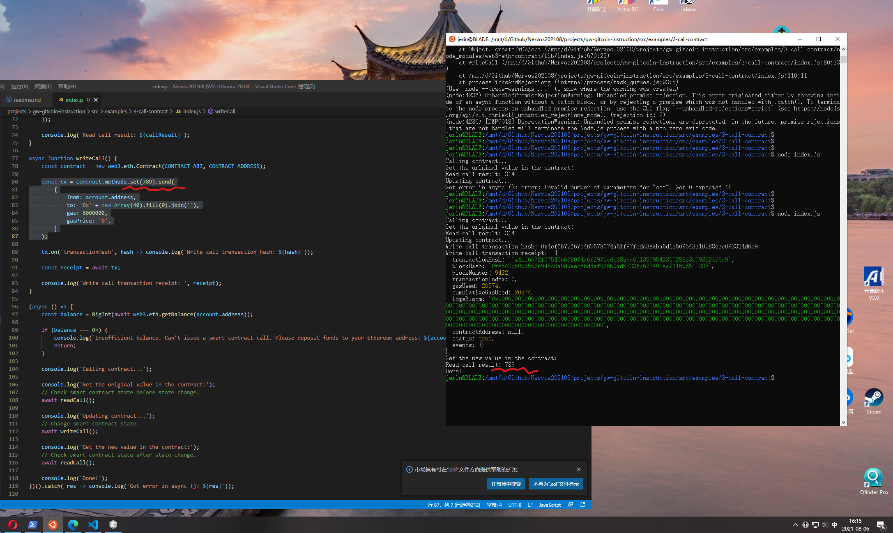

Task 3
===
1. A screenshot of the console output immediately after you have successfully issued a smart contract call.


2. The transaction hash from the console output (in text format).  
transaction hash: 0x4ef6b72f67546b678074a6ff97fcdc38aba6d13509543310288e3c093324d6c9

3. The contract address that you called (in text format).  
contract address: 0xB622889fFd2D59d3B7FfbdFe18a5D4Cd1a3462b9

4. The ABI for contract you made a call on (in text format).
```
[
    {
      "inputs": [],
      "stateMutability": "payable",
      "type": "constructor"
    },
    {
      "inputs": [
        {
          "internalType": "uint256",
          "name": "x",
          "type": "uint256"
        }
      ],
      "name": "set",
      "outputs": [],
      "stateMutability": "payable",
      "type": "function"
    },
    {
      "inputs": [],
      "name": "get",
      "outputs": [
        {
          "internalType": "uint256",
          "name": "",
          "type": "uint256"
        }
      ],
      "stateMutability": "view",
      "type": "function"
    }
  ]
```


---

Steps
===

## 0 CKB
* address:
  * mainnet: ckb1qyqfd3khs2xjracz53dk5npdhkphxy05xe7ss2m2qy
  * testnet: ckt1qyqfd3khs2xjracz53dk5npdhkphxy05xe7sd094vc
* lock_arg: 0x96c6d7828d21f702a45b6a4c2dbd837311f4367d
* lock_hash: 0xa06c18eba979303d6067598884ba204c262527d4537560b9d2ac48fe20535ac1

Export Your Private Key:
* 550fc1855a7c61d2fae5f9b1b47a01f83712946ca1da8ebcf3e1addfe628836a
* 08de1c9f62290bdc5e162be50a56d8161cfbe43a630c73ee555bdbd71ccc3c6e

> The first line of this file is your private key. To use it with applications we need to copy it from this file, and add the '0x' prefix to mark it as hex string.
> The second line in the file is chain code for the BIP44 standard, but we will not use this so it can be safely ignored.

## 1 ETH
metamask: 0x1281414c0349aa08BDd895519480E98c554550e7
private key: 25c9c92b688904d5eae02b6ea79730ad9639aeb0a18ce2802789be53b0b2950c
==> Nervos CKB - Testnet
* address: ckt1q3vvtay34wndv9nckl8hah6fzzcltcqwcrx79apwp2a5lkd07fdxxy5pg9xqxjd2pz7a3923jjqwnrz4g4gww6ypssy
* Lock Script Code Hash: 0x58c5f491aba6d61678b7cf7edf4910b1f5e00ec0cde2f42e0abb4fd9aff25a63
* Lock Script Hash Type: type
* Lock Script Args: 0x1281414c0349aa08bdd895519480e98c554550e7
* Lock Script Hash: 0x5fa237abf4744a5e393a24232ac3197ea2c81215a75504ebd6c5e9b3297b0a03

## 2 Attention!!!!
the original code: 
```
const tx = contract.methods.YOUR_WRITE_FUNCTION_NAME().send(
        {
            from: account.address,
            to: '0x' + new Array(40).fill(0).join(''),
            gas: 6000000,
            gasPrice: '0',
        }
    );
```

should changed to `YOUR_WRITE_FUNCTION_NAME(888)`