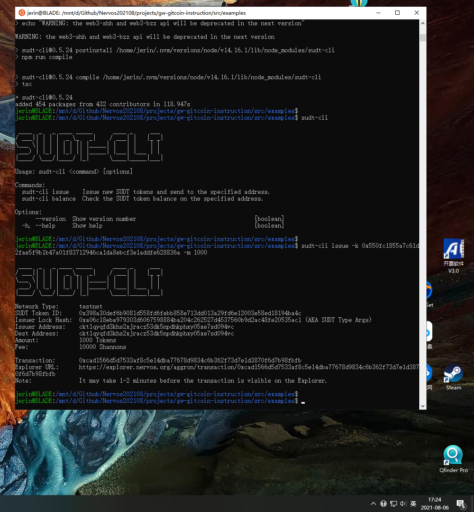
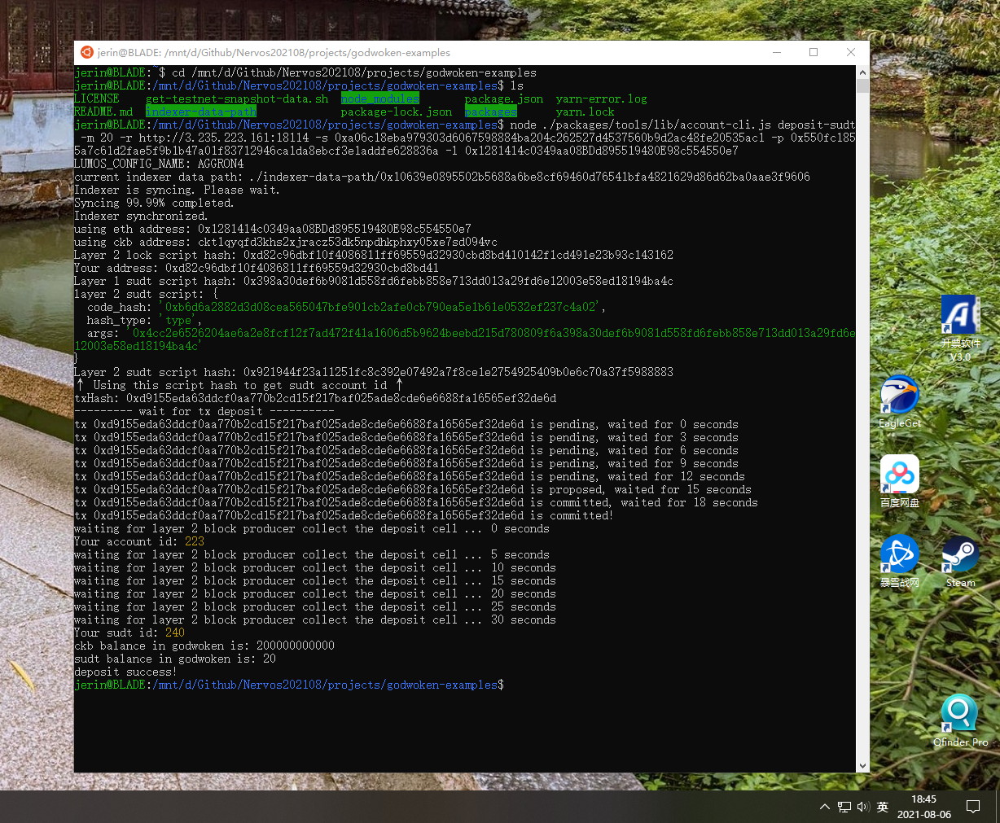

Task 4
===

1. A link to the Layer 1 address you funded on the Testnet Explorer.
address: [ckt1qyqfd3khs2xjracz53dk5npdhkphxy05xe7sd094vc](https://explorer.nervos.org/aggron/address/ckt1qyqfd3khs2xjracz53dk5npdhkphxy05xe7sd094vc)

2. screenshot of the console output immediately after using sudt-cli to create your SUDT tokens on Layer 1.


3. link to the transaction ID created by sudt-cli on the Testnet Explorer.
transaction: [0xcad1566d5d7533af8c5e14dba77678d9834c6b362f73d7e1d3870f6d7b98fbfb](https://explorer.nervos.org/aggron/transaction/0xcad1566d5d7533af8c5e14dba77678d9834c6b362f73d7e1d3870f6d7b98fbfb)

4. screenshot of the console output immediately after you have successfully submitted a deposit to Layer 2 using the account-cli tool.


5. The SUDT ID from the console output after executing the deposit script (in text format).
SUDT ID: 240
SUDT Token ID: 0x398a30def6b9081d558fd6febb858e713dd013a29fd6e12003e58ed18194ba4c

```
using eth address: 0x1281414c0349aa08BDd895519480E98c554550e7
using ckb address: ckt1qyqfd3khs2xjracz53dk5npdhkphxy05xe7sd094vc
Layer 2 lock script hash: 0xd82c96dbf10f4086811ff69559d32930cbd8bd410142f1cd491e23b93c143162
Your address: 0xd82c96dbf10f4086811ff69559d32930cbd8bd41
Layer 1 sudt script hash: 0x398a30def6b9081d558fd6febb858e713dd013a29fd6e12003e58ed18194ba4c
layer 2 sudt script: {
  code_hash: '0xb6d6a2882d3d08cea565047bfe901cb2afe0cb790ea5e1b61e0532ef237c4a02',
  hash_type: 'type',
  args: '0x4cc2e6526204ae6a2e8fcf12f7ad472f41a1606d5b9624beebd215d780809f6a398a30def6b9081d558fd6febb858e713dd013a29fd6e12003e58ed18194ba4c'
}
Layer 2 sudt script hash: 0x921944f23a11251fc8c392e07492a7f8ce1e2754925409b0e6c70a37f5988883
↑ Using this script hash to get sudt account id ↑
txHash: 0xd9155eda63ddcf0aa770b2cd15f217baf025ade8cde6e6688fa16565ef32de6d
```

---

Steps
===

address:
  mainnet: ckb1qyqfd3khs2xjracz53dk5npdhkphxy05xe7ss2m2qy
  testnet: ckt1qyqfd3khs2xjracz53dk5npdhkphxy05xe7sd094vc
lock_arg: 0x96c6d7828d21f702a45b6a4c2dbd837311f4367d
lock_hash: 0xa06c18eba979303d6067598884ba204c262527d4537560b9d2ac48fe20535ac1

0. Export Your Private Key
550fc1855a7c61d2fae5f9b1b47a01f83712946ca1da8ebcf3e1addfe628836a
08de1c9f62290bdc5e162be50a56d8161cfbe43a630c73ee555bdbd71ccc3c6e

> The first line of this file is your private key. To use it with applications we need to copy it from this file, and add the '0x' prefix to mark it as hex string.
> The second line in the file is chain code for the BIP44 standard, but we will not use this so it can be safely ignored.

1. metamask: 0x1281414c0349aa08BDd895519480E98c554550e7
private key: 25c9c92b688904d5eae02b6ea79730ad9639aeb0a18ce2802789be53b0b2950c
==> Nervos CKB - Testnet
* address: ckt1q3vvtay34wndv9nckl8hah6fzzcltcqwcrx79apwp2a5lkd07fdxxy5pg9xqxjd2pz7a3923jjqwnrz4g4gww6ypssy
* Lock Script Code Hash: 0x58c5f491aba6d61678b7cf7edf4910b1f5e00ec0cde2f42e0abb4fd9aff25a63
* Lock Script Hash Type: type
* Lock Script Args: 0x1281414c0349aa08bdd895519480e98c554550e7
* Lock Script Hash: 0x5fa237abf4744a5e393a24232ac3197ea2c81215a75504ebd6c5e9b3297b0a03

2. Issue SUDT Tokens
cmd: sudt-cli issue -k 0x550fc1855a7c61d2fae5f9b1b47a01f83712946ca1da8ebcf3e1addfe628836a -m 1000
```
Network Type:      testnet
SUDT Token ID:     0x398a30def6b9081d558fd6febb858e713dd013a29fd6e12003e58ed18194ba4c
Issuer Lock Hash:  0xa06c18eba979303d6067598884ba204c262527d4537560b9d2ac48fe20535ac1 (AKA SUDT Type Args)
Issuer Address:    ckt1qyqfd3khs2xjracz53dk5npdhkphxy05xe7sd094vc
Dest Address:      ckt1qyqfd3khs2xjracz53dk5npdhkphxy05xe7sd094vc
Amount:            1000 Tokens
Fee:               10000 Shannons

Transaction:       0xcad1566d5d7533af8c5e14dba77678d9834c6b362f73d7e1d3870f6d7b98fbfb
Explorer URL:      https://explorer.nervos.org/aggron/transaction/0xcad1566d5d7533af8c5e14dba77678d9834c6b362f73d7e1d3870f6d7b98fbfb
```

check balance
cmd sudt-cli balance -k 0x550fc1855a7c61d2fae5f9b1b47a01f83712946ca1da8ebcf3e1addfe628836a

3. Deposit Layer 1 SUDT Tokens to on Layer 2
cmd: node ./packages/tools/lib/account-cli.js deposit-sudt -m 20 -r http://3.235.223.161:18114 -s 0xa06c18eba979303d6067598884ba204c262527d4537560b9d2ac48fe20535ac1 -p 0x550fc1855a7c61d2fae5f9b1b47a01f83712946ca1da8ebcf3e1addfe628836a -l 0x1281414c0349aa08BDd895519480E98c554550e7
