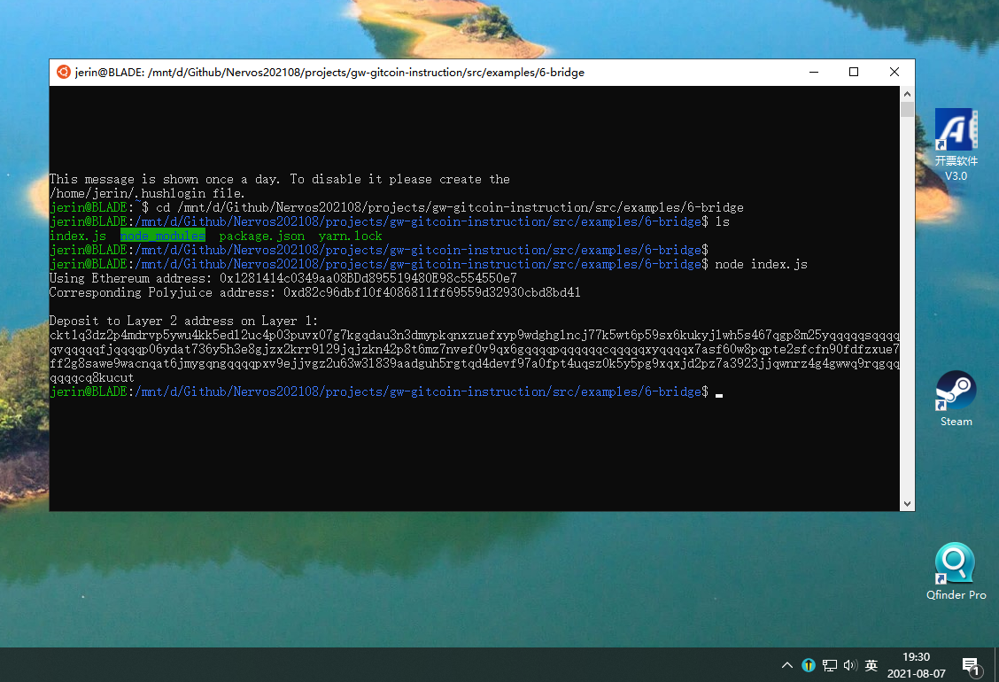
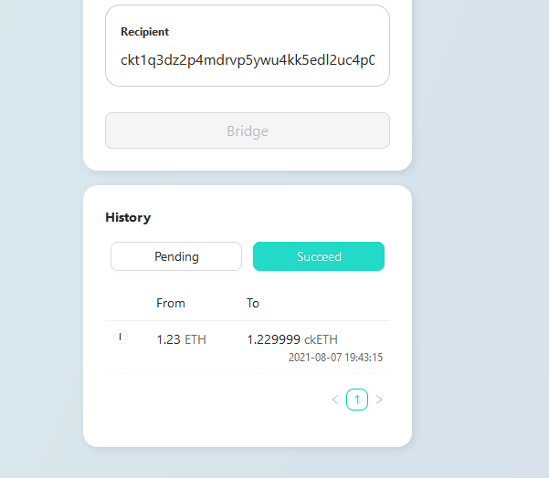
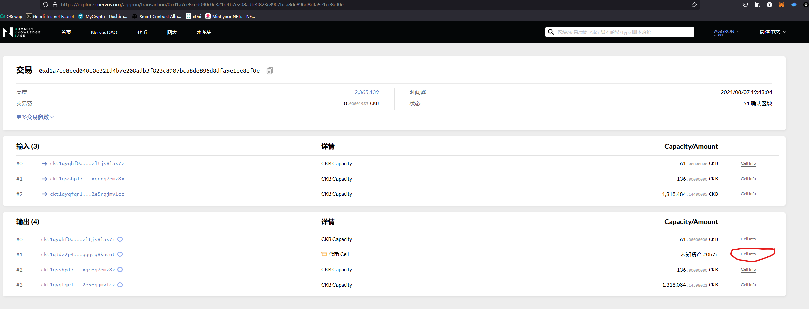
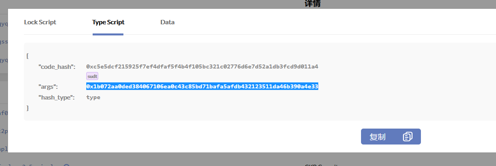

Task 6
===

1. A screenshot of the console output immediately after you have successfully generated your Deposit Receiver Address.

2. Your Deposit Receiver Address (in text format).
ckt1q3dz2p4mdrvp5ywu4kk5edl2uc4p03puvx07g7kgqdau3n3dmypkqnxzuefxyp9wdghglncj77k5wt6p59sx6kukyjlwh5s467qgp8m25yqqqqqsqqqqqvqqqqqfjqqqqp06ydat736y5h3e8gjzx2krr9l29jqjzkn42p8t6mz7nvef0v9qx6gqqqqpqqqqqqcqqqqqxyqqqqx7asf60w8pqpte2sfcfn90fdfzxue7ff2g8sawe9wacnqat6jmygqngqqqqpxv9ejjvgz2u63w3l839aadguh5rgtqd4devf97a0fpt4uqsz0k5y5pg9xqxjd2pz7a3923jjqwnrz4g4gwwq9rqgqqqqqqcq8kucut

3. The Ethereum address used to generate the Deposit Receiver Address (in text format).
Ethereum address: 0x1281414c0349aa08BDd895519480E98c554550e7

4. A link to the Etherscan explorer for the successful Force Bridge transaction. This can be found on Force Bridge under History→Succeed.
transaction: [0x65c7289a2425de408ccf7d14a1770797fbb68c9d3673a212d7a290f15ac1d7a8](https://rinkeby.etherscan.io/tx/0x65c7289a2425de408ccf7d14a1770797fbb68c9d3673a212d7a290f15ac1d7a8)

5. A link to the Nervos explorer for the successful Force bridge transaction. This can be found on Force Bridge under History→Succeed.
transaction: [0xd1a7ce8ced040c0e321d4b7e208adb3f823c8907bca8de896d8dfa5e1ee8ef0e](https://explorer.nervos.org/aggron/transaction/0xd1a7ce8ced040c0e321d4b7e208adb3f823c8907bca8de896d8dfa5e1ee8ef0e)

---

Steps
===

## 0 CKB
* address:
  * mainnet: ckb1qyqfd3khs2xjracz53dk5npdhkphxy05xe7ss2m2qy
  * testnet: ckt1qyqfd3khs2xjracz53dk5npdhkphxy05xe7sd094vc
* lock_arg: 0x96c6d7828d21f702a45b6a4c2dbd837311f4367d
* lock_hash: 0xa06c18eba979303d6067598884ba204c262527d4537560b9d2ac48fe20535ac1

Export Your Private Key:
* 550fc1855a7c61d2fae5f9b1b47a01f83712946ca1da8ebcf3e1addfe628836a
* 08de1c9f62290bdc5e162be50a56d8161cfbe43a630c73ee555bdbd71ccc3c6e

> The first line of this file is your private key. To use it with applications we need to copy it from this file, and add the '0x' prefix to mark it as hex string.
> The second line in the file is chain code for the BIP44 standard, but we will not use this so it can be safely ignored.

## 1 ETH
metamask: 0x1281414c0349aa08BDd895519480E98c554550e7
private key: 25c9c92b688904d5eae02b6ea79730ad9639aeb0a18ce2802789be53b0b2950c
==> Nervos CKB - Testnet
* address: ckt1q3vvtay34wndv9nckl8hah6fzzcltcqwcrx79apwp2a5lkd07fdxxy5pg9xqxjd2pz7a3923jjqwnrz4g4gww6ypssy
* Lock Script Code Hash: 0x58c5f491aba6d61678b7cf7edf4910b1f5e00ec0cde2f42e0abb4fd9aff25a63
* Lock Script Hash Type: type
* Lock Script Args: 0x1281414c0349aa08bdd895519480e98c554550e7
* Lock Script Hash: 0x5fa237abf4744a5e393a24232ac3197ea2c81215a75504ebd6c5e9b3297b0a03

## 2 Calculate Your Layer 2 Deposit Receiver Address: examples/6-bridge
* eth: 0x1281414c0349aa08BDd895519480E98c554550e7
* Corresponding Polyjuice address: 0xd82c96dbf10f4086811ff69559d32930cbd8bd41
* Deposit to Layer 2 address on Layer 1: ckt1q3dz2p4mdrvp5ywu4kk5edl2uc4p03puvx07g7kgqdau3n3dmypkqnxzuefxyp9wdghglncj77k5wt6p59sx6kukyjlwh5s467qgp8m25yqqqqqsqqqqqvqqqqqfjqqqqp06ydat736y5h3e8gjzx2krr9l29jqjzkn42p8t6mz7nvef0v9qx6gqqqqpqqqqqqcqqqqqxyqqqqx7asf60w8pqpte2sfcfn90fdfzxue7ff2g8sawe9wacnqat6jmygqngqqqqpxv9ejjvgz2u63w3l839aadguh5rgtqd4devf97a0fpt4uqsz0k5y5pg9xqxjd2pz7a3923jjqwnrz4g4gwwq9rqgqqqqqqcq8kucut

## 3 get Type args of ckETH
1. visit the [transaction](https://explorer.nervos.org/aggron/transaction/0xd1a7ce8ced040c0e321d4b7e208adb3f823c8907bca8de896d8dfa5e1ee8ef0e)
2. view CellInfo of UDT cell:

3. TypeScript tab: the value in args is the Type args of ckETH
