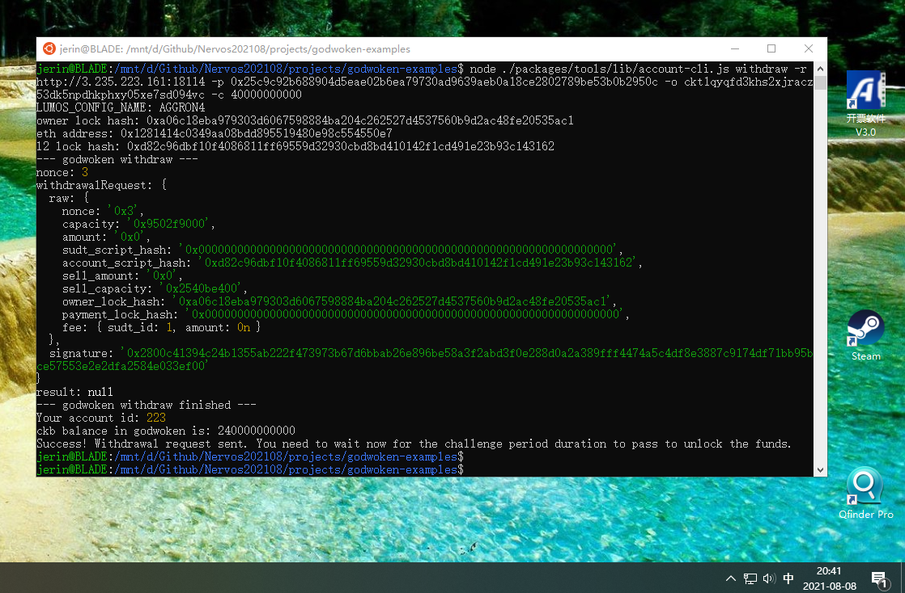

Task 9: Initiate Withdrawal Process from the Layer 2 back to Layer 1
===

1. A screenshot of the console output immediately after running the withdraw command.


2. The Ethereum address that you've used for your Layer 2 account (in text format).
0x1281414c0349aa08BDd895519480E98c554550e7

3. The Nervos Layer 1 address that you passed to withdraw command (in text format).
ckt1qyqfd3khs2xjracz53dk5npdhkphxy05xe7sd094vc

---

Steps
===

## 0 CKB
* address:
  * mainnet: ckb1qyqfd3khs2xjracz53dk5npdhkphxy05xe7ss2m2qy
  * testnet: ckt1qyqfd3khs2xjracz53dk5npdhkphxy05xe7sd094vc
* lock_arg: 0x96c6d7828d21f702a45b6a4c2dbd837311f4367d
* lock_hash: 0xa06c18eba979303d6067598884ba204c262527d4537560b9d2ac48fe20535ac1

Export Your Private Key:
* 550fc1855a7c61d2fae5f9b1b47a01f83712946ca1da8ebcf3e1addfe628836a
* 08de1c9f62290bdc5e162be50a56d8161cfbe43a630c73ee555bdbd71ccc3c6e

> The first line of this file is your private key. To use it with applications we need to copy it from this file, and add the '0x' prefix to mark it as hex string.
> The second line in the file is chain code for the BIP44 standard, but we will not use this so it can be safely ignored.

## 1 ETH
metamask: 0x1281414c0349aa08BDd895519480E98c554550e7
private key: 25c9c92b688904d5eae02b6ea79730ad9639aeb0a18ce2802789be53b0b2950c
==> Nervos CKB - Testnet
* address: ckt1q3vvtay34wndv9nckl8hah6fzzcltcqwcrx79apwp2a5lkd07fdxxy5pg9xqxjd2pz7a3923jjqwnrz4g4gww6ypssy
* Lock Script Code Hash: 0x58c5f491aba6d61678b7cf7edf4910b1f5e00ec0cde2f42e0abb4fd9aff25a63
* Lock Script Hash Type: type
* Lock Script Args: 0x1281414c0349aa08bdd895519480e98c554550e7
* Lock Script Hash: 0x5fa237abf4744a5e393a24232ac3197ea2c81215a75504ebd6c5e9b3297b0a03

## 2 Calculate Your Layer 2 Deposit Receiver Address: examples/6-bridge
* eth: 0x1281414c0349aa08BDd895519480E98c554550e7
* Corresponding Polyjuice address: 0xd82c96dbf10f4086811ff69559d32930cbd8bd41
* Deposit to Layer 2 address on Layer 1: ckt1q3dz2p4mdrvp5ywu4kk5edl2uc4p03puvx07g7kgqdau3n3dmypkqnxzuefxyp9wdghglncj77k5wt6p59sx6kukyjlwh5s467qgp8m25yqqqqqsqqqqqvqqqqqfjqqqqp06ydat736y5h3e8gjzx2krr9l29jqjzkn42p8t6mz7nvef0v9qx6gqqqqpqqqqqqcqqqqqxyqqqqx7asf60w8pqpte2sfcfn90fdfzxue7ff2g8sawe9wacnqat6jmygqngqqqqpxv9ejjvgz2u63w3l839aadguh5rgtqd4devf97a0fpt4uqsz0k5y5pg9xqxjd2pz7a3923jjqwnrz4g4gwwq9rqgqqqqqqcq8kucut

## 3  Execute the Withdraw Command
command: node ./packages/tools/lib/account-cli.js withdraw -r http://3.235.223.161:18114 -p 0x25c9c92b688904d5eae02b6ea79730ad9639aeb0a18ce2802789be53b0b2950c -o ckt1qyqfd3khs2xjracz53dk5npdhkphxy05xe7sd094vc -c 40000000000

**the output result**
```
LUMOS_CONFIG_NAME: AGGRON4
owner lock hash: 0xa06c18eba979303d6067598884ba204c262527d4537560b9d2ac48fe20535ac1
eth address: 0x1281414c0349aa08bdd895519480e98c554550e7
l2 lock hash: 0xd82c96dbf10f4086811ff69559d32930cbd8bd410142f1cd491e23b93c143162
--- godwoken withdraw ---
nonce: 3
withdrawalRequest: {
  raw: {
    nonce: '0x3',
    capacity: '0x9502f9000',
    amount: '0x0',
    sudt_script_hash: '0x0000000000000000000000000000000000000000000000000000000000000000',
    account_script_hash: '0xd82c96dbf10f4086811ff69559d32930cbd8bd410142f1cd491e23b93c143162',
    sell_amount: '0x0',
    sell_capacity: '0x2540be400',
    owner_lock_hash: '0xa06c18eba979303d6067598884ba204c262527d4537560b9d2ac48fe20535ac1',
    payment_lock_hash: '0x0000000000000000000000000000000000000000000000000000000000000000',
    fee: { sudt_id: 1, amount: 0n }
  },
  signature: '0x2800c41394c24b1355ab222f473973b67d6bbab26e896be58a3f2abd3f0e288d0a2a389fff4474a5c4df8e3887c9174df71bb95bce57553e2e2dfa2584e033ef00'
}
result: null
--- godwoken withdraw finished ---
Your account id: 223
ckb balance in godwoken is: 240000000000
Success! Withdrawal request sent. You need to wait now for the challenge period duration to pass to unlock the funds.
```